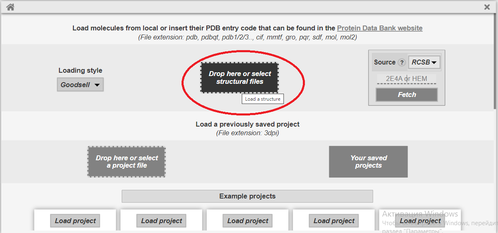
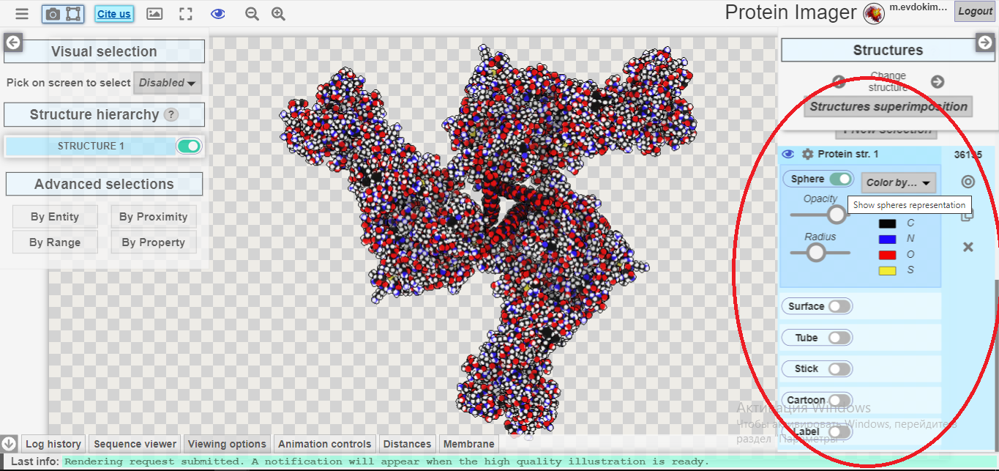
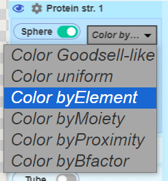
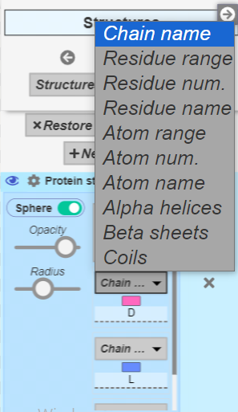
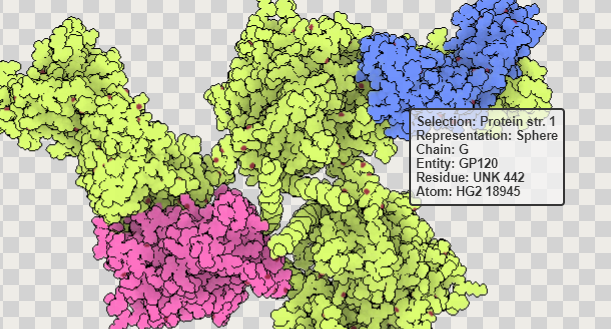
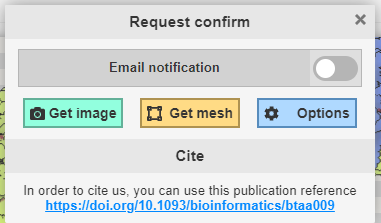

ПО: protein imager https://3dproteinimaging.com/protein-imager/ 
Белок: https://www.rcsb.org/structure/4CC8 
Инструкция по применению: 
    1) Загрузить выбранную структуру белка на сайт:   
    2) На панели справа можно выбрать выриант отображения модели и настроить его:  
    3) В настройках каждого отображения есть варианты доступных для него раскрасок:  
    4) Названия отображений не всегда соответсвуют названиям в дз: 
        wireframe - stick 
        ribbons - cartoon 
        backbone - tube 
        spacefill - sphere 
        molecular surface - surface 
    5) По умолчанию раскраска по атомам отличается от раскраски CPK только цветом атома углерода - серый, вместо чёрного 
    6) Для раскраски по частям можно выбрать желаемый участок, указав его название:   
    Название участка видно при наведении:  
    7) Для загрузки изображения нужно нажать соответствующую кнопку:  
    Во всплывающем окне можно перейти в настройки качества или сразу перейти к загрузке результата:  

