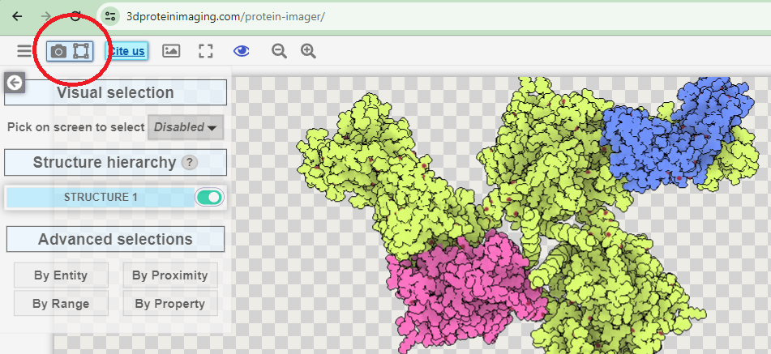

ПО: protein imager https://3dproteinimaging.com/protein-imager/
Белок: https://www.rcsb.org/structure/4CC8
Инструкция по применению:
    1) Загрузить выбранную структуру белка на сайт:  \n
    2) На панели справа можно выбрать выриант отображения модели и настроить его: \n
    3) В настройках каждого отображения есть варианты доступных для него раскрасок: \n
    4) Названия отображений не всегда соответсвуют названиям в дз:
        wireframe - stick
        ribbons - cartoon
        backbone - tube
        spacefill - sphere
        molecular surface - surface
    5) По умолчанию раскраска по атомам отличается от раскраски CPK только цветом атома углерода - серый, вместо чёрного
    6) Для раскраски по частям можно выбрать желаемый участок, указав его название:  
    Название участка видно при наведении: 
    7) Для загрузки изображения нужно нажать соответствующую кнопку: 
    Во всплывающем окне можно перейти в настройки качества или сразу перейти к загрузке результата: 

