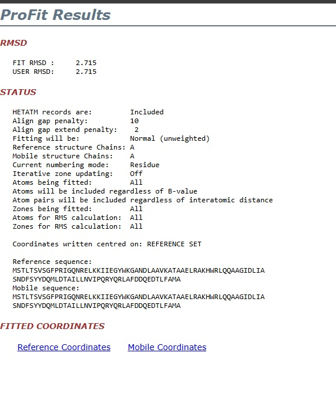
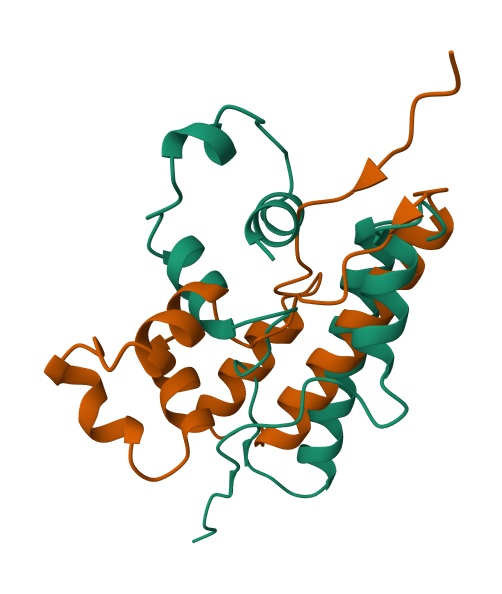
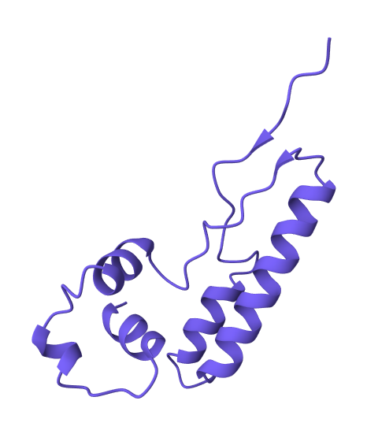
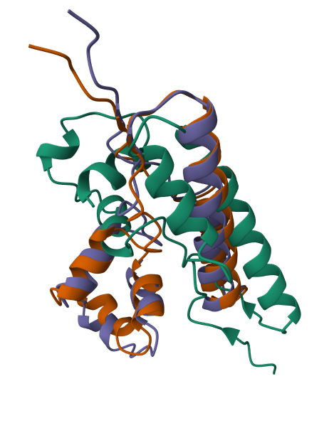

1) Последовательность: MSTLTSVSGFPRIGQNRELKKIIEGYWKGANDLAAVKATAAELRAKHWRLQQAAGIDLIASNDFSYYDQMLDTAILLNVIPQRYQRLAFDDQEDTLFAMA

Инструменты: ESMFold и OpenFold для предсказаний и ProFit для выравнивания.

2) Ноутбуки:
https://colab.research.google.com/drive/1KPDY_P9C8UCGEnThWm6qHbRSAJwcMPIa?usp=sharing
https://colab.research.google.com/drive/1UOrEC8vT1CMhItDgEWAemj8ccZ8YHsFE?usp=sharing

3) Полученные файлы: ptm0.595_r3_default.pdb и selected_prediction.pdb

4) Веб версия ПроФит выдала всё, кроме собственно результата выравнивания:

Установил десктоп версию, загрузил файлы, запустил выравнивание, получил файл с результатом: output.pdb

5-6) Визуализировал полученные последовательности (файл сессии - mol-star_state_2024-12-8-16-8-31.molx):

Сравнение исходных структур:

Выравнивание:

Всё вместе:

7) Предсказания имеют частично схожую структуру (например большая спираль, расположенная на скриншотах справа).
Также несколько частей являются зеркальными отражениями друг друга (маленькие спирали слева и справа).
Полученное выравнивание в бОльшей степени похоже на предсказание из файла ptm0.595_r3_default.pdb.
