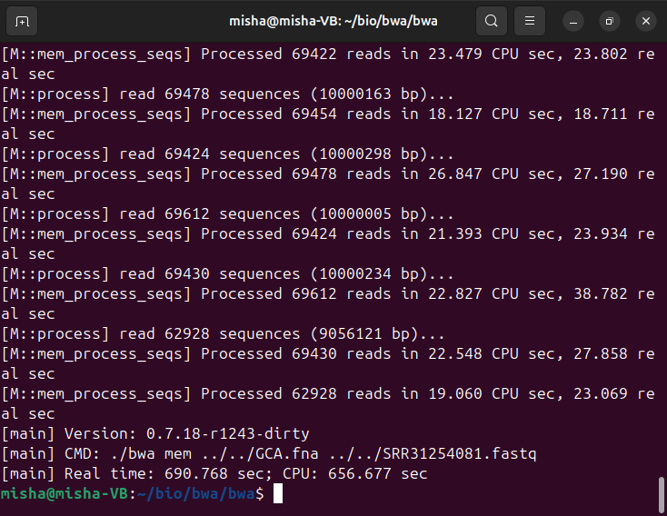
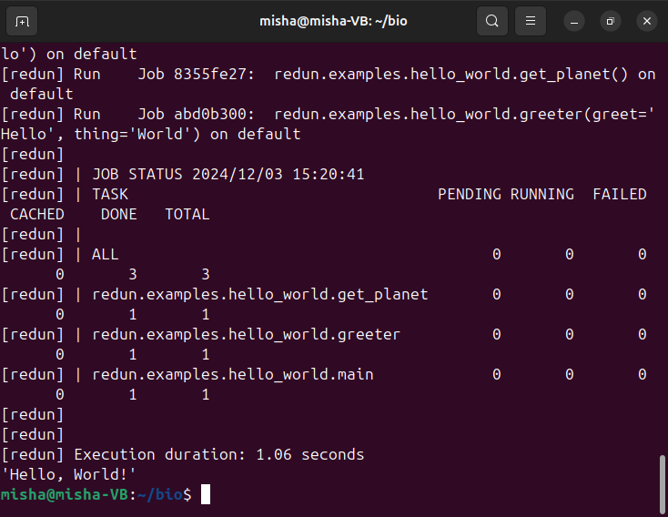
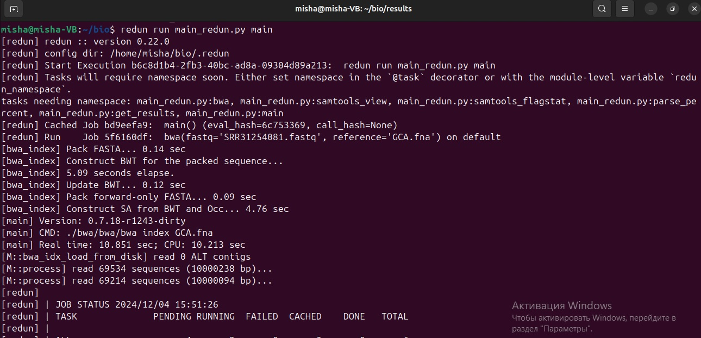
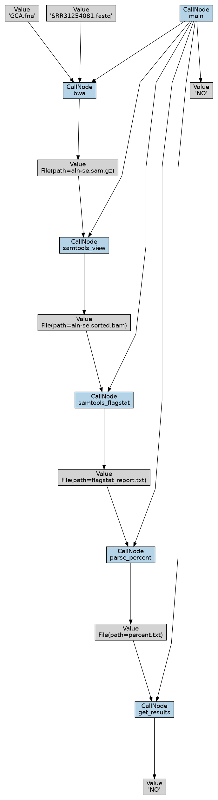

1) Скачал файлы с белками: https://www.ncbi.nlm.nih.gov/sra/?term=SRR31254081 и https://www.ncbi.nlm.nih.gov/datasets/genome/GCF_000005845.2/
2) Установка FastQC: Скачал и установил зип архив приложения, установил на виртуальную машину джаву: ```sudo apt install default-jre```, поменял права для запуска файла: ```chmod 755 fastqc```, запустил FastQC: ```./fastqc SRR31254081.fastq```
В результате получил файл .html
3) Скачал и распаковал bwa. Запустил индексирование: ```bwa index GCA.fna``` (файл заранее переименовал чтобы в командной строке писать меньше).
После выполнения появилось несколько вспомогательных файлов.
4) Запустил выравнивание ридов: ```bwa mem GCA.fna SRR31254081.fastq.gz | gzip -3 > aln-se.sam.gz```
Процесс был долгим:

5) Установка Samtools:

Building each desired package from source is very simple (вот тут врут, потребовалось несколько дополнительных пакетов установить):

```cd samtools-1.x```    
```./configure --prefix=/where/to/install```
```make```
```make install```

Преобразование и сортировка с помощью Samtools:
```./samtools view -Sb aln-se.sam.gz > aln-se.bam```
```./samtools sort aln-se.bam -o aln-se.sorted.bam```

6) Получение оценки качества выравнивания:
```./samtools flagstat aln-se.sorted.bam > flagstat_report.txt```
Результатом стал такой файлик:
1878477 + 0 in total (QC-passed reads + QC-failed reads)
1866822 + 0 primary
0 + 0 secondary
11655 + 0 supplementary
0 + 0 duplicates
0 + 0 primary duplicates
1289280 + 0 mapped (68.63% : N/A)
1277625 + 0 primary mapped (68.44% : N/A)
0 + 0 paired in sequencing
0 + 0 read1
0 + 0 read2
0 + 0 properly paired (N/A : N/A)
0 + 0 with itself and mate mapped
0 + 0 singletons (N/A : N/A)
0 + 0 with mate mapped to a different chr
0 + 0 with mate mapped to a different chr (mapQ>=5)

7) Написал и запустил скрипт, который находит в репорт файле оценку выравнивания и говорит NOT OK если значение меньше 90%

8) Для установки фреймворка Redun необходимо установить python и pip (я использовал pipx, потому что pip ругался: "error: externally-managed-environment" и просил создать ему виртуальное окружение)
дальше пишем ```pipx install redun``` и ```pipx install redun[viz] --force``` (без -f флага говорит, что редан уже установлен, но визуализация при этом не работает) и ```pipx ensurepath```

Всё, редан стоит и доступен глобально.

9) Нашёл в документации hello_world пример, переписал его и запустил: ```redun run hello_world.py main```
Результат: 

10) Все команды с инструментами и баш скрипт переписал в виде redun пайплайна (файл main_redun.py).


В результате получил сообщение "NO" (почему то вместо not ok я сделал чтобы оно выводило no)

11) Запустил визуализатор:
```redun viz b6c8d1b4-2fb3-40bc-ad8a-09304d89a213 --output DAG```


12) Даг схема по смыслу схожа с блок-схемой алгоритма, но в ней нет развилки, так как в моём случае при постоянном значении оценки качества выравнивания всегда выполняется ветка not okay. (Поэтому сортировку я выполнял до развилки).
